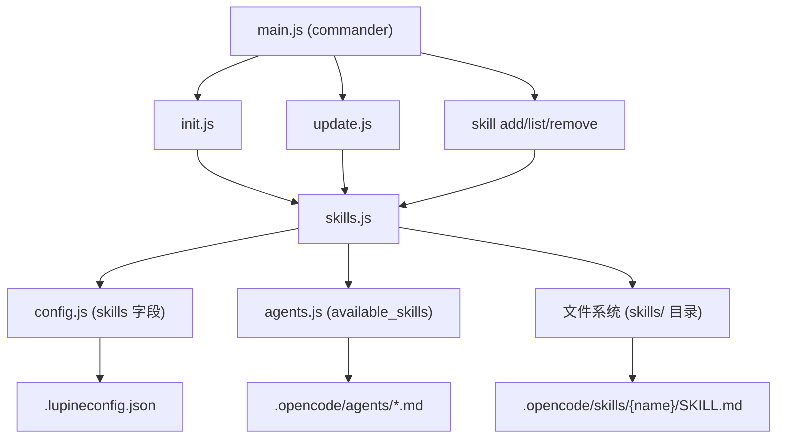

# v0.6 Skill 交付功能实现

> **For agentic workers:** Steps use checkbox (`- [ ]`) syntax for tracking.

**目标：** 实现 `lupine skill add/list/remove` 命令族，扩展 Init/Update 流程以支持 Skill 自动安装与探查，实现 Agent `available_skills` 联动注入。

**架构：** 核心逻辑集中在 `src/skills.js`，CLI 注册在 `main.js`，Init/Update 流程修改已有文件，Agent 配置联动在 `agents.js`。

**技术栈：** Node.js 18+, commander.js ^12, Node 内置 fs/path/crypto/child_process

---

## 文件清单

| 文件 | 操作 | 说明 |
|------|------|------|
| `packages/lupine/src/skills.js` | **创建** | 核心技能管理模块：add/list/remove/sync/inspect |
| `packages/lupine/templates/skills/_recommended.json` | **创建** | 推荐 Skill 清单（来源、forAgents 等元数据） |
| `packages/lupine/templates/skills/lupine-diagram/SKILL.md` | **创建** | 自研（builtin）Skill 文件 |
| `packages/lupine/templates/.lupineconfig.json` | **修改** | 添加 `skills` 字段空结构 |
| `packages/lupine/src/main.js` | **修改** | 注册 `skill` 命令组 (`add/list/remove`) |
| `packages/lupine/src/config.js` | **修改** | 添加 `readSkillsConfig` / `writeSkillsConfig` / `ensureSkillsField` |
| `packages/lupine/src/init.js` | **修改** | 插入 Skill 复制/安装/探查步骤 |
| `packages/lupine/src/update.js` | **修改** | 添加 `--sync-skills` 选项处理 |
| `packages/lupine/src/agents.js` | **修改** | 添加 `available_skills` 注入逻辑 |
| `packages/lupine/templates/agents/_agents.json` | **修改** | 添加 `available_skills` 字段模板 |

---

### Task 1: 配置基础设施扩展

**目标：** 扩展配置模板和读写 API，为 Skill 管理提供数据支撑。

- [x] **Step 1.1: 更新 `.lupineconfig.json` 模板，添加 skills 字段**

  文件: `packages/lupine/templates/.lupineconfig.json`

  在现有字段后追加 `skills` 空结构：
  ```json
  {
    "version": "0.4.0",
    "projectName": "{project_name}",
    "platform": "opencode",
    "repositories": [],
    "skills": {
      "installed": [],
      "recommended": [],
      "adopted": []
    }
  }
  ```

  验收条件：模板包含完整的 skills 三字段结构。

- [x] **Step 1.2: 扩展 `config.js` 添加技能配置读写 API**

  文件: `packages/lupine/src/config.js`

  新增以下导出函数：
  - `readSkillsConfig(lupineDir)` — 读取 `skills` 字段，若不存在返回默认空结构
  - `writeSkillsConfig(lupineDir, skillsObj)` — 写入 `skills` 字段（保留其他配置字段）
  - `ensureSkillsField(lupineDir)` — 确保 `.lupineconfig.json` 包含 skills 字段（若没有则追加空结构）

  验收条件：config 模块导出上述 3 个函数，空 config 调用 `ensureSkillsField` 后自动补齐 skills 字段。

- [x] **Step 1.3: 创建推荐 Skill 清单文件**

  文件: `packages/lupine/templates/skills/_recommended.json`

  内容结构：
  ```json
  {
    "version": "1.0.0",
    "skills": [
      {
        "name": "lupine-diagram",
        "description": "生成 Gliffy 风格 SVG 架构图/流程图",
        "source": "builtin",
        "forAgents": ["lupine"]
      },
      {
        "name": "brainstorming",
        "description": "创意发散引导，需求探讨阶段发散→收敛",
        "source": "https://github.com/obra/superpowers",
        "skillPath": "brainstorming",
        "forAgents": ["lupine"]
      },
      {
        "name": "impeccable",
        "description": "代码质量与规范审查",
        "source": "npm",
        "installCommand": "npx impeccable skills install",
        "forAgents": ["lupine-evaluator"]
      }
    ]
  }
  ```

  验收条件：文件格式合法 JSON，cover 全部三种来源类型（builtin / GitHub URL / npm）。

- [x] **Step 1.4: 将 `lupine-diagram` 自研 Skill 纳入模板目录**

  文件: `packages/lupine/templates/skills/lupine-diagram/SKILL.md`

  将现有 `.opencode/skills/lupine-diagram/SKILL.md` 复制到模板目录。内容与项目当前已安装的版本一致（Gliffy 风格 SVG 规范、节点样式、连接线规则等）。

  验收条件：`templates/skills/lupine-diagram/SKILL.md` 存在且内容完整。

---

### Task 2: 核心技能管理模块

**目标：** 创建 `src/skills.js`，实现所有 Skill 管理逻辑，独立于 CLI 层。

- [x] **Step 2.1: 创建 `src/skills.js` 骨架**

  文件: `packages/lupine/src/skills.js`

  创建模块文件，导入依赖（fs/path/child_process/crypto），导出以下函数占位：
  ```js
  export async function addSkill(source, options) {}
  export async function listSkills(lupineDir) {}
  export async function removeSkill(name, options) {}
  export async function syncSkills(lupineDir, options) {}
  export async function copyBuiltinSkills(lupineDir, platform) {}
  export async function installRecommendedSkills(lupineDir, platform) {}
  export async function inspectNonRecommendedSkills(lupineDir, platform) {}
  ```

  验收条件：模块文件创建不报错，7 个导出函数均为 async。

- [x] **Step 2.2: 实现 Skill 来源解析函数**

  文件: `packages/lupine/src/skills.js`

  实现内部函数 `parseSkillSource(source)`，返回类型化对象：
  - GitHub URL 模式: `https://github.com/{owner}/{repo}` → `{ type: 'github', owner, repo, branch: 'main' }`
  - npm 命令模式: 以 `npx` 或 `npm` 开头 → `{ type: 'npm', command: '...' }`
  - 简单名称模式: 以上均不匹配时（如 `impeccable`），查询 `_recommended.json` 中 `name` 匹配的条目，使用其 `installCommand`（npm）或 `source`（其他来源）自动映射来源类型；未找到 → throw Error
  - 本地路径模式: 以 `/`、`./`、`../` 开头或为本地目录 → `{ type: 'local', path: '...' }`
  - 非法来源 → throw Error

  验收条件：全部 4 种来源类型都能正确识别，`impeccable` 等简单名称自动匹配到 npm 来源；非法来源抛出有意义的错误。

- [x] **Step 2.3: 实现 Skill 下载与文件复制**

  文件: `packages/lupine/src/skills.js`

  实现内部函数 `downloadSkill(sourceInfo, tempDir)` 和 `copySkillToTarget(sourcePath, targetDir, skillName)`：
  - GitHub: 用 `git clone --depth 1 {url} {tempDir}`（通过 `child_process.execFile`），然后按 `--skill` 参数或根目录 SKILL.md 定位
  - npm: 直接执行 `execSync(command)` 调用外部命令安装
  - local: 使用 `fs.cp` 递归复制目录

  `copySkillToTarget` 逻辑：
  - 创建目标目录 `.opencode/skills/{name}/` 或 `.claude/skills/{name}/`
  - 复制 SKILL.md 及同目录下所有关联文件
  - 返回目标路径

  验收条件：三种来源均能正确将 Skill 文件写入目标平台目录。

- [x] **Step 2.4: 实现 SKILL.md 格式校验**

  文件: `packages/lupine/src/skills.js`

  实现函数 `validateSkill(skillDir)`：
  - 检查 `{skillDir}/SKILL.md` 存在
  - 校验 Frontmatter 格式：
    - `---` 包裹（开头和结尾必须有 `---` 行）
    - YAML 解析成功（YAML.parse 无异常）
    - `name` 字段**必填**（缺失 → 阻断错误）
    - `description` 字段**推荐**（缺失 → 警告信息，不阻断）
  - 返回 `{ valid: boolean, name: string, errors: string[], warnings: string[] }`

  验收条件：无 Frontmatter / YAML 解析失败 / 无 name 字段 / 文件不存在的场景都能正确检测；description 缺失仅返回 warnings 不阻断。

- [x] **Step 2.5: 实现 `addSkill()` 完整逻辑**

  文件: `packages/lupine/src/skills.js`

  `addSkill(source, options)` 实现采用 **"先验后迁"两阶段策略**：

  **Phase 1 — 解析 & 预下载（验前不做任何写入）**
  1. 读取 `.lupineconfig.json` 获取 platform
  2. 解析 source 类型（调用 parseSkillSource）
  3. GitHub / npm / local 来源 → 下载到临时目录 `os.tmpdir()/{uuid}`（独立唯一子目录）
  4. 若 `--skill` 参数指定了子目录，在临时目录中定位
  5. 调用 `validateSkill(tempDir)` 验证 SKILL.md 完整性

  **Phase 2 — 通过后一步迁移**
  6. 所有校验通过后：
     a. `fs.cp/rename` 从临时目录到目标平台目录（`{platformDir}/skills/{name}/`）
     b. 写入 config `skills.installed[]`
     c. 调用 `updateAgentSkills()` 更新 Agent `available_skills`
  7. **finally 块**：删除临时目录（无论成功或失败）

  **幂等性处理**：
  - 目标目录已存在 → 默认跳过并打印 `⚠ Skill {name} 已安装（使用 --force 重新安装）`
  - `--force` 时 → 先删除已有目录，再执行完整安装流程

  **dryRun 模式**：
  - `dryRun: true` 时，执行全流程（解析、下载到临时目录、校验）但跳过 Phase 2 的全部写入操作
  - 输出 `[DRY-RUN] 将安装 {name} → {targetDir}`，并描述后续将要执行的操作列表
  - 临时目录在 dry-run 结束后清理（finally 块）

  `options` 支持：`{ skill, platform, dryRun, force }`

  验收条件：运行 `lupine skill add <source>` 后 Skill 被安装到正确目录，config 被更新，Agent 文件被注入；`--dry-run` 时不写入任何文件；Skill 已安装时自动跳过，`--force` 时重新安装。

- [x] **Step 2.6: 实现 `listSkills()`（以 config 为权威来源）

  文件: `packages/lupine/src/skills.js`

  `listSkills(lupineDir)` 以 config `skills.installed[]` 为权威来源，文件系统扫描为辅助验证：

  1. **读取 config**：获取 `skills.installed[]` 和 `skills.adopted[]`
  2. **验证已安装**：对 config 中每个条目，检查目录是否存在：
     - 存在 → 读取 SKILL.md 提取 name/description，归入 `installed[]`
     - **不存在** → 归入 `configResidue[]`，输出警告 `⚠ 配置残留: {name}（目录不存在）`
  3. **推荐未安装**：读取 `_recommended.json`，过滤掉 `installed[]` + `adopted[]` 中已有的
  4. **非推荐已安装（探查）**：
     - 扫描平台目录所有子目录
     - 排除 `config.installed[]` 和 `_recommended.json` 中已记录的
     - 剩余目录若有 SKILL.md 则读取元数据，归入 `nonRecommended[]`

  返回 `{ installed: [], recommended: [], nonRecommended: [], configResidue: [] }`

  验收条件：输出四组状态清晰的列表；config 记录但目录已删除时正确归入 configResidue 并输出警告；每种状态包含 name + description + source。

- [x] **Step 2.7: 实现 `removeSkill()`**

  文件: `packages/lupine/src/skills.js`

  `removeSkill(name, options)` 实现：
  1. 检查 Skill 目录是否存在（不存在 → 输出错误信息并返回）
  2. `dryRun: true` 时 → 跳过所有写入，输出 `[DRY-RUN] 将删除 {name} 目录，并从 config 和 Agent 文件中移除` 并返回
  3. 递归删除目录（`fs.rmSync(..., { recursive: true, force: true })`）
  4. 从 config `skills.installed[]` 和 `skills.adopted[]` 中移除
  5. 调用 `updateAgentSkills()` 移除对应的 `available_skills` 引用
  6. 输出成功信息

  验收条件：删除目录后配置同步更新，Agent 文件中对应 skill 引用被移除。

- [x] **Step 2.8: 实现 `syncSkills()`**

  文件: `packages/lupine/src/skills.js`

  `syncSkills(lupineDir, options)` 实现：
  1. 读取 `_recommended.json`
  2. 对每个 source 为 `builtin` 的 skill：重新复制模板目录中的文件
  3. 对 source 为 `github` 或 `npm` 的推荐 skill：重新下载安装
  4. **不处理** `adopted` 中的用户自纳 Skill
  5. 更新 manifest 和 config

  验收条件：运行后所有推荐 Skill 被刷新到最新，adopted 不受影响。

- [x] **Step 2.9: 实现 `copyBuiltinSkills()`**

  文件: `packages/lupine/src/skills.js`

  `copyBuiltinSkills(lupineDir, platform)` 实现：
  1. 读取 `_recommended.json` 中 `source === "builtin"` 的 skill
  2. 从 `templates/skills/{name}/` 复制到 `{lupineDir}/{platformDir}/skills/{name}/`
  3. 更新 config 的 `skills.installed[]`
  4. 返回安装的 skill 列表

  验收条件：Init 时自动复制 lupine-diagram 到平台目录。

- [x] **Step 2.10: 实现 `installRecommendedSkills()`**

  文件: `packages/lupine/src/skills.js`

  `installRecommendedSkills(lupineDir, platform)` 实现：
  1. 读取 `_recommended.json` 中 `source !== "builtin"` 的 skill
  2. 对每个 skill：
     - GitHub URL: 调用 `addSkill()` 内部逻辑
     - npm: 执行 installCommand
  3. 更新 config（合并到 `skills.installed[]`）
  4. 返回安装结果列表（含成功/失败状态）

  验收条件：Init 时自动安装 brainstorming 和 impeccable（后者仅执行 npx 命令）。

- [x] **Step 2.11: 实现非推荐 Skill 探查**

  文件: `packages/lupine/src/skills.js`

  `inspectNonRecommendedSkills(lupineDir, platform)` 实现：
  1. 扫描平台目录下的 Skill 目录
  2. 过滤掉 `_recommended.json` 中的和 config `installed[]` 中的
  3. 对每个剩余目录读取 SKILL.md 提取元数据
  4. 返回探查结果列表

  验收条件：能发现项目目录中非推荐安装的 Skill。

---

### Task 3: CLI 命令注册

**目标：** 在 `main.js` 注册 `skill` 命令组。

- [x] **Step 3.1: 注册 `skill` 命令组**

  文件: `packages/lupine/src/main.js`

  在 `init` 和 `update` 命令后追加：
  ```js
  const skill = program.command('skill').description('Skill 管理');
  ```
  暂不添加子命令（后续步骤实现）。

  验收条件：`lupine skill --help` 输出命令组帮助。

- [x] **Step 3.2: 实现 `skill add` 子命令**

  文件: `packages/lupine/src/main.js`

  ```js
  skill
    .command('add <source>')
    .description('安装 Skill')
    .option('-s, --skill <name>', '指定 Skill 名称（多 Skill 仓库时使用）')
    .option('-p, --platform <name>', 'AI 平台 (opencode/claude)')
    .option('--dry-run', '预览模式')
    .option('--force', '强制覆盖')
    .action(async (source, options) => {
      const { addSkill } = await import('./skills.js');
      await addSkill(source, options);
    });
  ```

  验收条件：`lupine skill add https://github.com/obra/superpowers --skill brainstorming` 可执行。

- [x] **Step 3.3: 实现 `skill list` 子命令**

  文件: `packages/lupine/src/main.js`

  ```js
  skill
    .command('list')
    .description('查看已安装和推荐的 Skill')
    .action(async () => {
      const { listSkills } = await import('./skills.js');
      const result = await listSkills(process.cwd());
      // 格式化输出三组状态
    });
  ```

  输出格式示例：
  ```
  📦 已安装 (2):
    • lupine-diagram  — 生成 SVG 架构图  [builtin]
    • brainstorming   — 创意发散引导       [github]

  💡 推荐未安装 (1):
    • impeccable      — 代码审查           [npm]

  ⚠️ 非推荐探查 (0):
  ```

  验收条件：运行 `lupine skill list` 后输出分类清晰的三组列表。

- [x] **Step 3.4: 实现 `skill remove` 子命令**

  文件: `packages/lupine/src/main.js`

  ```js
  skill
    .command('remove <name>')
    .description('移除 Skill')
    .option('--dry-run', '预览模式')
    .action(async (name, options) => {
      const { removeSkill } = await import('./skills.js');
      await removeSkill(name, options);
    });
  ```

  验收条件：`lupine skill remove brainstorming` 后目录被删除，配置和 Agent 文件同步更新。

---

### Task 4: Agent 配置联动

**目标：** 安装/移除 Skill 后自动更新 Agent 文件的 `available_skills` 列表。

- [x] **Step 4.1: 更新 `_agents.json` 模板，添加 available_skills 占位**

  文件: `packages/lupine/templates/agents/_agents.json`

  为每个 Agent 对象添加 `available_skills` 字段（空数组占位）：
  ```json
  {
    "lupine": {
      "description": "...",
      "available_skills": [],
      "opencode": { ... },
      "claude": { ... }
    }
  }
  ```

  验收条件：lupine、lupine-planner、lupine-executor、lupine-evaluator 全部 4 个 Agent 都包含 `available_skills: []`。

- [x] **Step 4.2: 在 `agents.js` 中实现 available_skills 注入逻辑**

  文件: `packages/lupine/src/agents.js`

  新增导出函数 `updateAgentSkills(lupineDir, platform, skillsList)`：
  1. 读取当前 `.lupineconfig.json` 的 `skills.installed` 列表
  2. 读取 `_recommended.json` 匹配 `forAgents` 映射
  3. 遍历 Agent 定义文件（`{agent}.md`）：
     - 注入 `available_skills` 到 YAML frontmatter
     - 格式为 opencode 兼容的 `available_skills` 列表
  4. 写入更新后的 Agent 文件

  修改 `renderOpencodeAgent()` 和 `renderClaudeAgent()` 以处理 `available_skills` 字段：
  - opencode 格式：注入为 YAML 数组
  - claude 格式：注入为 YAML 数组

  验收条件：调用 `updateAgentSkills` 后 Agent 文件的 frontmatter 中出现 `available_skills: [...]`。

- [x] **Step 4.3: 集成到 Skill 安装/移除流程**

  文件: `packages/lupine/src/skills.js`

  在 `addSkill()` 和 `removeSkill()` 末尾调用 `updateAgentSkills()`。

  验收条件：安装 Skill 后 Agent 文件自动更新，移除后自动清理。

---

### Task 5: Init 流程扩展

**目标：** 让 `init.js` 在创建项目时自动处理 Skill。

- [x] **Step 5.1: 在 `init.js` 中插入自研 Skill 复制步骤**

  文件: `packages/lupine/src/init.js`

  在模板文件生成之后、config 写入之前，插入：
  ```js
  // 复制自研 Skill
  const { copyBuiltinSkills, installRecommendedSkills, inspectNonRecommendedSkills } = await import('./skills.js');
  
  const builtinSkills = await copyBuiltinSkills(lupineDir, platform);
  builtinSkills.forEach(s => console.log(`  ✔ 已复制自研 Skill: ${s.name} → ${s.path}`));
  ```

  验收条件：Init 完成后 `.opencode/skills/lupine-diagram/` 被创建。

- [x] **Step 5.2: 插入推荐外部 Skill 安装步骤**

  文件: `packages/lupine/src/init.js`

  在自研 Skill 复制之后插入：
  ```js
  const installResults = await installRecommendedSkills(lupineDir, platform);
  installResults.forEach(r => {
    if (r.success) console.log(`  ✔ 已安装推荐 Skill: ${r.name}`);
    else console.log(`  ⚠ 安装失败: ${r.name} — ${r.error}`);
  });
  ```

  验收条件：Init 时自动安装 brainstorming（从 GitHub clone）和 impeccable（调用 npx 命令）。

- [x] **Step 5.3: 插入非推荐 Skill 探查与交互式询问**

  文件: `packages/lupine/src/init.js`

  推荐安装之后插入：
  ```js
  const discovered = await inspectNonRecommendedSkills(lupineDir, platform);
  if (discovered.length > 0) {
    console.log(`\n⚠️ 发现非推荐 Skill（可能影响 Agent 效果）`);
    for (const sk of discovered) {
      console.log(`  ? ${sk.name}    来源不明，未经验证`);
      const answer = await askQuestion(`是否纳入 Lupine 配置? (Y/n)`, 'Y');
      if (answer.toLowerCase() === 'y' || answer === '') {
        // 更新 config 中的 adopted[]
        // 更新 Agent 文件
      }
    }
  }
  ```

  验收条件：目录中有非推荐 SKILL.md 时提示用户，选择 Y 后纳入 adopted 配置。

- [x] **Step 5.4: 更新 init 完成输出信息**

  文件: `packages/lupine/src/init.js`

  在最终输出中添加 Skill 相关内容：
  ```
  ✔ 已安装推荐 Skill: brainstorming → .opencode/skills/brainstorming/
  ✔ 已安装推荐 Skill: impeccable → .opencode/skills/impeccable/
  ```

  验收条件：Init 完成输出包含 Skill 安装摘要。

---

### Task 6: Update 流程扩展

**目标：** 为 `update.js` 添加 `--sync-skills` 选项。

- [x] **Step 6.1: 在 `main.js` 注册 `--sync-skills` 选项**

  文件: `packages/lupine/src/main.js`

  在 `update` 命令的 `.option()` 调用中添加：
  ```js
  .option('--sync-skills', '同时更新所有 builtin 和推荐外部 Skill')
  ```

  验收条件：`lupine update --help` 显示 `--sync-skills` 选项。

- [x] **Step 6.2: 在 `update.js` 中处理 `--sync-skills`**

  文件: `packages/lupine/src/update.js`

  在版本检查通过、文件更新完成后插入：
  ```js
  if (options.syncSkills) {
    console.log('\n🔄 同步 Skill...\n');
    const { syncSkills } = await import('./skills.js');
    await syncSkills(lupineDir, options);
    console.log('  ✔ Skill 已同步');
  }
  ```

  验收条件：`lupine update --sync-skills` 执行时触发技能同步逻辑。

---

### Task 7: 模板同步与 Manifest 扩展

**目标：** 确保 Skill 文件纳入模板同步和 manifest 管理。

- [x] **Step 7.1: 将 `templates/skills/` 纳入 `getTemplateFiles()`**

  文件: `packages/lupine/src/generate.js`

  在 `getTemplateFiles()` 返回的列表中追加 Skill 路径：
  ```js
  'skills/_recommended.json',
  'skills/lupine-diagram/SKILL.md',
  ```

  验收条件：模板同步时 skills 目录下的文件被同步。

- [x] **Step 7.2: 更新 `scripts/sync-templates.js` 处理 skills 目录**

  文件: `packages/lupine/scripts/sync-templates.js`

  在脚本中增加 `scanDirectory()` 函数，自动发现 `templates/skills/` 下所有文件并计算 checksum，纳入 `_manifest.json`：
  ```js
  function scanDirectory(dir, basePath = '') {
    const entries = fs.readdirSync(dir, { withFileTypes: true });
    const result = [];
    for (const entry of entries) {
      const fullPath = path.join(dir, entry.name);
      const relativePath = path.join(basePath, entry.name);
      if (entry.isDirectory()) {
        result.push(...scanDirectory(fullPath, relativePath));
      } else {
        result.push({
          path: relativePath,
          checksum: crypto.createHash('sha256')
            .update(fs.readFileSync(fullPath))
            .digest('hex')
        });
      }
    }
    return result;
  }
  ```
  在 manifest 生成逻辑中调用 `scanDirectory(templatesDir)` 并入总清单，取代手动列举每条路径的方式。

  验收条件：`templates/skills/` 下新增文件后 manifest 自动记录；文件变更后 checksum 变化可检测。

---

## 架构图



---

## 关键设计决策

1. **单模块聚合**：所有 Skill 管理逻辑集中在 `src/skills.js`，不拆分子模块。逻辑按函数拆分，保持内聚。
2. **GitHub 来源使用 `git clone --depth 1`**：开发环境必有 git，无需额外依赖；且深度 1 不下载历史，速度快。
3. **Agent `available_skills` 用 YAML frontmatter 注入**：兼容 opencode 和 claude 格式，注入在 render 阶段完成。
4. **`forAgents` 映射维护在 `_recommended.json`**：单一事实来源，Init 时一次性建立映射，安装/移除时增量更新。
5. **非推荐 Skill 不自动纳入**：只做展示和询问，用户确认后才写入 `adopted[]`，避免无意中引入不稳定 Skill。
