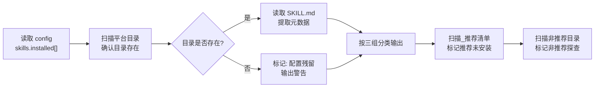

# Plan 审查报告：v0.6 Skill 交付功能实现

> 审查人：评估器（Evaluator）

---

## 审查结论：需修改

Plan 整体质量较高，结构清晰，覆盖了绝大多数 spec 需求。但存在 2 个**中等严重度**问题和若干**低严重度**问题，建议修改后进入执行阶段。

**通过率**：8/12 约束通过，4 项需改进。

---

## 逐项评估表格

| 约束 | 评估 | 说明 |
|------|------|------|
| **冒烟测试** | ✅ 通过 | 核心命令 `skill add/list/remove` 路径完整，Init/Update 扩展通道清晰 |
| **回归测试** | ✅ 通过 | 现有 init.js / update.js / agents.js / config.js / generate.js 的变更点都已指出，不破坏现有功能 |
| **功能测试** | ⚠️ 需改进 | 功能覆盖度高，但缺少部分失败回滚机制，参见问题 #1 |
| **边界值测试** | ⚠️ 需改进 | 来源解析（合法/非法）和 validateSkill 的边界已覆盖，但 addSkill 的并发/重装/磁盘满等边界未讨论 |
| **等价类划分** | ✅ 通过 | 三种来源类型（GitHub/npm/local）都覆盖，推荐清单三种来源类型都覆盖 |

---

## 需求覆盖率矩阵

### specs/构建交付.md — 需求覆盖

| 需求 | 覆盖状态 | Plan 步骤 | 备注 |
|------|---------|-----------|------|
| `skill add <source>` GitHub | ✅ 已覆盖 | 2.2, 2.3, 2.5, 3.2 | `git clone --depth 1` + `--skill` 子目录 |
| `skill add <source>` npm | ✅ 已覆盖 | 2.2, 2.3, 2.5, 3.2 | `execSync(command)` 执行 |
| `skill add <source>` 本地路径 | ✅ 已覆盖 | 2.2, 2.3, 2.5, 3.2 | `fs.cp` 递归复制 |
| `skill add` 选项 | ✅ 已覆盖 | 3.2 | `--skill`, `--platform`, `--dry-run`, `--force` |
| `skill list` 三组状态 | ✅ 已覆盖 | 2.6, 3.3 | 已安装 / 推荐未安装 / 非推荐探查 |
| `skill remove` | ✅ 已覆盖 | 2.7, 3.4 | 目录删除 + config + Agent 同步 |
| Init — 复制自研 Skill | ✅ 已覆盖 | 5.1 | `copyBuiltinSkills()` |
| Init — 自动安装推荐 Skill | ✅ 已覆盖 | 5.2 | `installRecommendedSkills()` |
| Init — 探查非推荐 Skill | ✅ 已覆盖 | 5.3 | `inspectNonRecommendedSkills()` + 交互询问 |
| Init — 模板类型选择 | ⚠️ 未覆盖 | — | Spec 交互流程显示"选择模板类型"，plan 未提及。**可能为早期版本的缺失功能**，需确认是否在 v0.6 范围内 |
| Init — `.lupineconfig.json` skills 字段 | ✅ 已覆盖 | 1.1, 1.2 | `installed` / `recommended` / `adopted` 三字段 |
| Init — Agent 定义含 available_skills | ✅ 已覆盖 | 4.1, 5.1~5.3 | 模板 + init 注入 |
| Update — `--sync-skills` 选项 | ✅ 已覆盖 | 6.1, 6.2 | CLI 注册 + 处理逻辑 |
| Update — `syncSkills` 不处理 adopted | ✅ 已覆盖 | 2.8 | 明确说明"不处理 adopted" |
| Agent 配置自动注入 | ✅ 已覆盖 | 4.1, 4.2, 4.3 | `updateAgentSkills()` |
| 非侵入式（仅操作项目目录） | ✅ 已覆盖 | 全部 | 仅操作 `.lupine/` + `.opencode/` + `.claude/` |

### specs/角色模型.md — 需求覆盖

| 需求 | 覆盖状态 | Plan 步骤 | 备注 |
|------|---------|-----------|------|
| brainstorming → Lupine | ✅ 已覆盖 | 1.3 | `forAgents: ["lupine"]` |
| lupine-diagram → Lupine | ✅ 已覆盖 | 1.3 | `forAgents: ["lupine"]` |
| impeccable → Evaluator | ✅ 已覆盖 | 1.3 | `forAgents: ["lupine-evaluator"]` |
| Skill 项目级目录 | ✅ 已覆盖 | 2.3 | `.opencode/skills/{name}/` 或 `.claude/skills/{name}/` |
| Init 自动安装推荐 Skill | ✅ 已覆盖 | 5.2 | `installRecommendedSkills()` |
| 非推荐 Skill 用户确认 | ✅ 已覆盖 | 5.3 | 交互式 `askQuestion` |
| available_skills 三层能力结构 | ✅ 已覆盖 | 4.2 | Layer 2 MCP/Skill 注入 |

---

## 文件清单完整性

| 文件 | 操作 | Plan 步骤 | 状态 |
|------|------|-----------|------|
| `packages/lupine/src/skills.js` | 创建 | 2.1~2.11 | ✅ 明确 |
| `packages/lupine/templates/skills/_recommended.json` | 创建 | 1.3 | ✅ 明确 |
| `packages/lupine/templates/skills/lupine-diagram/SKILL.md` | 创建 | 1.4 | ✅ 明确 |
| `packages/lupine/templates/.lupineconfig.json` | 修改 | 1.1 | ✅ 明确 |
| `packages/lupine/src/main.js` | 修改 | 3.1~3.4, 6.1 | ✅ 明确 |
| `packages/lupine/src/config.js` | 修改 | 1.2 | ✅ 明确 |
| `packages/lupine/src/init.js` | 修改 | 5.1~5.4 | ✅ 明确 |
| `packages/lupine/src/update.js` | 修改 | 6.2 | ✅ 明确 |
| `packages/lupine/src/agents.js` | 修改 | 4.2 | ✅ 明确 |
| `packages/lupine/templates/agents/_agents.json` | 修改 | 4.1 | ✅ 明确 |
| `packages/lupine/src/generate.js` | 修改 | 7.1 | ✅ 明确 |
| `packages/lupine/scripts/sync-templates.js` | 修改 | 7.2 | ✅ 明确 |

**文件清单完整性：✅ 通过** — 12 个文件均已列出，无遗漏。

---

## 依赖关系与执行顺序评估

```
Task 1 (配置基础) ──→ Task 2 (skills.js 核心) ──→ Task 3 (CLI 注册)
                                        ├──→ Task 4 (Agent 联动)
                                        ├──→ Task 5 (Init 扩展)
                                        └──→ Task 6 (Update 扩展)
Task 7 (模板同步) ──→ 可独立并行
```

**评估：✅ 合理**

- Task 1（config 基础设施）是其他所有 Task 的前提，排在最前 ✅
- Task 2（skills.js 核心）是 Task 3~6 的依赖，排第二 ✅
- Task 3（CLI）依赖于 Task 2 ✅
- Task 4（Agent 联动）在 Step 4.3 要求集成到 add/remove 流程，所以必须在 Task 2 之后 ✅
- Task 5（Init 扩展）依赖于 `skills.js` 的函数 ✅
- Task 6（Update 扩展）依赖于 `skills.js` 的 `syncSkills` ✅
- Task 7（模板同步）基本独立 ✅

---

## 问题列表

### 问题 #1（中等）：addSkill 缺少回滚/清理机制

**位置**：Step 2.5 — addSkill 完整逻辑

**描述**：addSkill 执行流程为多步骤操作（解析→下载→校验→更新 config→更新 Agent 文件），中间任何一步失败时，已执行的操作没有清理。例如：
- `git clone` 成功 → `validateSkill()` 失败 → 临时文件未清理
- 文件复制成功 → config 更新失败 → 磁盘残留

**建议**：采用"先临时目录下载 + 校验 → 校验通过后原子化复制到目标"的两阶段策略，或在异常处理中增加 `try-catch-finally` 清理逻辑。

---

### 问题 #2（中等）：listSkills 以文件系统扫描为主，配置为辅

**位置**：Step 2.6 — listSkills 实现

**描述**：listSkills 通过扫描平台目录确定"已安装"Skill，再对比 `_recommended.json` 和 config 确定分类。但这种策略的问题：
- 用户手动删除 Skill 目录后，config 中 `installed[]` 仍残留记录
- 反过来，目录手动创建了 SKILL.md 但 config 没记录，状态混乱
- 两个事实来源（文件系统 vs config）可能不一致

**建议**：以 config `skills.installed[]` 为权威来源，文件系统扫描为辅助验证。发现不一致时输出警告。或者维护一个"预期清单"与文件系统实时对比。

---

### 问题 #3（低）：dryRun 模式未铺开实现细节

**位置**：Step 2.5 / 2.7 — addSkill/removeSkill

**描述**：Step 3.2/3.4 的 CLI 层声明了 `--dry-run` 选项并传给 `options.dryRun`，但 Step 2.5/2.7 的实现描述中未说明 dry-run 模式下的具体行为（应模拟所有操作但不实际写入文件系统和配置）。

**建议**：在 Step 2.5/2.7 中补充 dry-run 的契约：
> `dryRun: true` 时，执行全流程但跳过所有文件写入、config 修改、Agent 文件修改；输出将要执行的操作描述。

---

### 问题 #4（低）：Step 4.1 "所有 4 个 Agent" 表述不够精确

**位置**：Step 4.1

**描述**：specs/角色模型.md 定义了 5 个角色（Lupine/Explorer/Planner/Executor/Evaluator），而 `_agents.json` 实际定义了 4 个（lupine, lupine-planner, lupine-executor, lupine-evaluator，不包含 Explorer）。"所有 4 个 Agent"的表述可能引起困惑。

**建议**：明确列出 4 个 Agent 的名称：`lupine`、`lupine-planner`、`lupine-executor`、`lupine-evaluator`。

---

### 问题 #5（低）：npm 来源的 `skill add` UX 可优化

**位置**：Step 2.2

**描述**：当前设计要求用户输入 `lupine skill add "npx impeccable skills install"` 这样的完整命令作为 source 参数。这与其他来源（GitHub URL、本地路径）的 UX 不一致，且带空格/引号的参数容易让用户出错。

**建议**：考虑支持 `lupine skill add npm:impeccable` 或 `lupine skill add impeccable --from-npm` 等更方便的语法，由 Lupine 内部从 `_recommended.json` 查找对应的 installCommand。

---

### 问题 #6（低）：validateSkill 的 Frontmatter 规范不完整

**位置**：Step 2.4

**描述**：仅要求 `name` 字段，可选 `description`。但 SKILL.md 作为交付格式，应该有更完整的规范定义（如 `source`、`version`、`forAgents` 等字段）。

**建议**：补充 SKILL.md frontmatter 规范文档，作为 `rules/` 或 `specs/` 的一部分。明确哪些是必需字段、格式要求。

---

### 问题 #7（低）：sync-templates.js 需扩展以支持 skills 目录

**位置**：Step 7.2

**描述**：当前 `sync-templates.js` 通过静态 `SYNC_MAP` 和 `MANUAL_TEMPLATES` 管理文件清单。Step 7.2 要求将 `templates/skills/` 纳入 manifest 的 checksum 记录，但 plan 未说明具体方式——是静态添加还是动态扫描。

**建议**：在 sync-templates.js 中增加一个 `scanDirectory()` 函数，自动发现 `templates/skills/` 下的所有文件并计算 checksum，避免每次新增 builtin Skill 都要手动修改同步脚本。

---

## 改进建议

### 建议 A：补充 addSkill 的"先验后迁"策略

将 addSkill 的流程调整如下，从根本上避免回滚问题：

```
1. 解析 source
2. 下载到临时目录（os.tmpdir() 下的唯一子目录）
3. validateSkill(临时目录)
4. 校验通过 → fs.cp/rename 到目标平台目录（一步操作）
5. 更新 config（skills.installed[]）
6. 调用 updateAgentSkills()
7. 清理临时目录（finally 块）
```

这样只有校验通过的 Skill 才会落地到项目目录。

---

### 建议 B：配置优先的 listSkills 策略



---

### 建议 C：考虑 Skill 安装的幂等性

`addSkill` 在 Skill 已安装时：
- 默认行为应跳过并提示 `"Skill xxx 已安装，使用 --force 重新安装"`
- `--force` 时先删除旧目录再重新安装

当前 plan 未讨论重装场景。

---

### 建议 D：补充模板类型选择的确认

如果 spec 显示"选择模板类型：框架项目 / 应用项目 / 库项目"是 v0.6 范围内的需求，请补充到 init 流程中。如果不是，建议在 spec 中标注为"v0.5 已实现"或"推迟到 v0.7"，消除歧义。

---

## 总结

| 维度 | 评分 | 说明 |
|------|------|------|
| 需求覆盖 | ⭐⭐⭐⭐⭐ (5/5) | 核心需求全部覆盖，仅 1 项待确认 |
| 结构清晰度 | ⭐⭐⭐⭐⭐ (5/5) | Task-Step 分层合理，架构图清晰 |
| 验收条件 | ⭐⭐⭐⭐ (4/5) | 大部分明确可验证，少数偏笼统 |
| 错误处理 | ⭐⭐⭐ (3/5) | 基础错误路径已覆盖，但缺少回滚/部分失败处理 |
| 边界考虑 | ⭐⭐⭐ (3/5) | 来源解析覆盖了非法来源，但重装、并发、磁盘不足等未讨论 |

**结论：需修改。** 请参考问题 #1（回滚/清理）和问题 #2（listSkills 配置优先策略）做针对性修改后再进入代码执行阶段。

