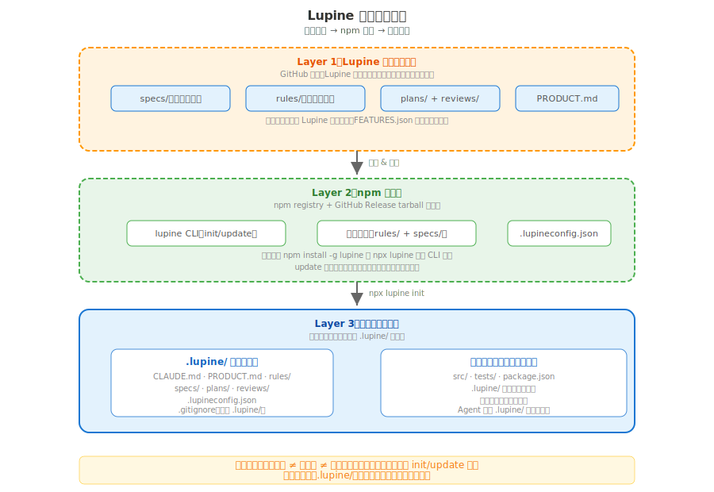

# 上下文体系

> 产出物模型、规范文件体系、Agent 定义体系、工作区配置、功能清单

---

## 1. 概述

上下文体系定义 Lupine 的所有**文档产出物**和**配置文件**，确保项目知识可持续、可追溯、可恢复。所有文档有明确的所有者、读者和更新规则。

---

## 2. 产出物模型

### 2.1 核心产出物

| 文档 | 读者 | 所有者 | 更新频率 | 回答的问题 |
|------|------|--------|---------|-----------|
| **AGENT.md** | AI | Lupine | 项目结构变化时 | 文档地图在哪？ |
| **ARCHITECTURE.md** | AI + 人 | Lupine | 架构变更时 | 这是什么项目？用什么写的？怎么跑？ |
| **PRODUCT.md** | AI + 人 | Lupine | 产品定位变化时 | 产品是什么？为谁而做？ |
| **proposal/** | 人（决策者） | Lupine | 技术选型/架构决策时 | 应该选哪个方案？ |
| **specs/** | 人（PM/开发者） | Lupine | 需求变更时 | WHAT + WHY |
| **plans/** | AI（执行器为主） | 规划器 | plan 不可行时 | HOW |
| **reviews/** | 人 + AI | 评估器 | 每次审查后 | 质量如何？ |
| **CHANGELOG.md** | 人 + AI | Lupine | 版本发布时 | 每个版本改了什么？ |
| **FEATURES.json** | AI（Agent） | Lupine | 功能变更时 | 项目有哪些功能？状态如何？ |

### 2.2 文档定义

**AGENT.md（AI 索引入口）**
- 位置：项目根目录
- 内容：精简导航目录 + 进场协议 + 文档地图
- 规则：Lupine 维护，所有 Agent 只读。始终注入（约 60 行）
- 前身：v0.6 及之前的 CLAUDE.md（详见 CHANGELOG.md）

**ARCHITECTURE.md（项目名片）**
- 位置：项目根目录
- 内容：产品架构（一句话）、技术架构（清单）、基础设施（启动/测试/部署命令）
- 规则：Lupine 维护，所有 Agent 只读。架构不变不重读
- 生成：`lupine init` 时主动探查源码区自动生成

**PRODUCT.md（产品总纲）**
- 位置：项目根目录
- 内容：产品定位、核心理念、目标用户、成功标准、范围边界
- 规则：只有 Lupine 能更新，其他角色只读

**specs/（需求规格）**
- 位置：`specs/` 目录
- 内容：按大类组织的 spec 文档（角色模型、协作机制、上下文体系、构建交付）
- 规则：Lupine 负责撰写和维护，其他角色只读

**proposal/（提案）**
- 位置：`proposal/` 目录
- 内容：技术选型对比、架构方案评审、中长期规划等调研型产出
- 生命周期：决策后可能归档，与 specs/ 独立演进
- 规则：仅 Lupine 可写，其他角色只读

**plans/（执行计划）**
- 位置：`plans/` 目录
- 内容：任务拆分、依赖关系、验收标准
- 规则：规划器撰写，Lupine 和执行器只读

**reviews/（审查记录）**
- 位置：`reviews/` 目录
- 内容：评估器的审查结果（通过/不通过 + 具体原因）
- 规则：评估器撰写，所有角色只读

**CHANGELOG.md（版本变更记录）**
- 位置：项目根目录
- 内容：按版本组织的变更摘要（新增/变更/修复）
- 规则：Lupine 在版本发布时维护，所有 Agent 只读

**FEATURES.json（功能清单）**
- 位置：项目根目录
- 内容：功能 ID、名称、状态（completed/in-progress/planned）、对应 spec 路径
- 用途：Agent 多会话上下文恢复、回归测试参考
- 规则：功能变更时更新。纯状态追踪，不夹带历史

---

## 3. 规范文件体系

### 3.1 文件清单

所有规范文件聚合在 `rules/` 目录：

| 文件 | 定位 | 读者 | 核心内容 |
|------|------|------|---------|
| `templates/agents/` | Agent prompt 模板 | 渲染为各 AI 工具的 Agent 配置 | 每个 Agent 的 prompt、MCP/Skill、约束 |
| `rules/coding.md` | 编码规范 | 执行器 | 技术栈、命名规范、测试要求 |
| `rules/git.md` | Git 规范 | 所有 Agent | 分支策略、Commit 规范、PR 流程 |

### 3.2 约束注入

约束直接内联在各 Agent 的 prompt 中，无需外部 YAML 文件。

---

## 4. Agent 定义体系

### 4.1 源模板

Agent prompt 模板存放在 `packages/lupine/templates/agents/`：

```
packages/lupine/templates/agents/
├── _agents.json            ← 多平台元数据（opencode/Claude 配置）
├── lupine.prompt           ← Lupine 提示词模板
├── lupine-planner.prompt   ← 规划器提示词模板
├── lupine-executor.prompt  ← 执行器提示词模板
└── lupine-evaluator.prompt ← 评估器提示词模板
```

### 4.2 渲染目标

根据使用的 AI 编码工具，模板渲染到不同位置：

| 工具 | 目标目录 | 格式 |
|------|---------|------|
| opencode | `.opencode/agents/*.md` | Markdown + frontmatter |
| Claude Code | `.claude/agents/*.md` | Markdown + frontmatter |
| 其他 | 按工具规范适配 | 工具指定的格式 |

### 4.3 文件结构

每个 Agent 定义文件包含：
- **frontmatter**：工具特定配置（mode、permissions、tools）
- **prompt 正文**：角色定义、工作流、约束（直接内联）

---

## 5. 工作区配置



### 5.1 工作区结构

`.lupine/` 是 Lupine 的**AI 工作区目录**，存放配置、产出物和规则。它与用户代码仓库通过 `.lupineconfig.json` 中的 `repositories` 统一配置管理。

```
.lupine/
├── .lupineconfig.json       ← 配置（workspace、repositories、版本等）
├── AGENT.md                 ← AI 索引入口（精简导航目录）
├── ARCHITECTURE.md          ← 项目名片
├── PRODUCT.md               ← 产品总纲
├── CHANGELOG.md             ← 版本变更记录
├── README.md                ← 项目介绍
├── rules/                   ← 规范文件
│   ├── coding.md
│   ├── evals.md
│   └── git.md
├── specs/                   ← 需求规格
├── proposal/                ← 提案（技术选型、架构方案）
├── plans/                   ← 执行计划
└── reviews/                 ← 审查记录
```

### 5.2 配置规范（.lupineconfig.json）

#### 配置结构

```json
{
  "version": "0.6.0",
  "projectName": "Lupine",
  "platform": "opencode",
  "workspace": {
    "path": "~/Code/Lupine/.lupine",
    "description": "Lupine AI 工作区（开发中枢），存放配置、产出物、规则"
  },
  "repositories": [
    {
      "name": "lupine",
      "path": "~/Code/Lupine",
      "description": "Lupine 项目源码（单仓库，包含 .github、packages、tests 等）"
    }
  ],
  "skills": { ... }
}
```

#### 区域概念（解耦设计）

**工作区（Workspace）**：
- Lupine AI 的"办公室"，存放配置和产出物
- 可以是独立 Git 仓库，也可以不是
- 只有 1 个

**源码区（Repositories）**：
- 用户的实际项目代码
- **一定是 Git 仓库**
- 至少 1 个，可以多个

**两者关系**：完全解耦，可以是以下三种之一：
- **被包含**：工作区在源码区内部（如本项目 `.lupine/` 在 `~/Code/Lupine/` 内）
- **独立**：工作区和源码区并列（不同目录）
- **包含**：源码区在工作区内部

#### 字段说明

**workspace（必填）**

| 字段 | 类型 | 说明 |
|------|------|------|
| `workspace.path` | string | **绝对路径**。AI 工作区目录，存放配置、产出物、规则 |
| `workspace.description` | string | 工作区描述，用于 AI 理解该区域用途 |

**repositories（必填，至少 1 个）**

| 字段 | 类型 | 必填 | 说明 |
|------|------|------|------|
| `repositories[].name` | string | 是 | 仓库标识名，唯一 |
| `repositories[].path` | string | 是 | **绝对路径**。Git 仓库根目录 |
| `repositories[].description` | string | 否 | 仓库描述，用于 AI 理解该区域用途 |

#### 路径规则

1. **所有路径字段**（`workspace.path`、`repositories[].path`）均为**绝对路径**
2. AI 直接使用绝对路径执行文件操作，无需解析相对路径
3. 工作区文件路径：`{workspace.path}/specs/xxx.md`
4. 源码区文件路径：`{repositories[].path}/src/xxx.js`

#### Git 操作规则

**核心原则**：源码区一定是 Git 仓库，工作区可以是也可以不是。

1. 找到文件所属 repository（通过路径前缀匹配）
2. 在该 repository 的 `path` 目录执行 git 命令

**示例**：
- 修改 `.lupine/specs/xxx.md` → 属于工作区
  - 若工作区在源码区内部（被包含关系）→ 在源码区 Git 根目录执行 `git add .lupine/specs/xxx.md`
  - 若工作区是独立 Git 仓库 → 在工作区目录执行 `git add specs/xxx.md`
- 修改 `packages/lupine/src/xxx.js` → 属于源码区
  - 在 `~/Code/Lupine` 执行 `git add packages/lupine/src/xxx.js`

#### 典型场景配置

**场景 1：工作区被包含在源码区内（单仓库，最常见）**

```json
{
  "workspace": {
    "path": "~/Code/Lupine/.lupine",
    "description": "AI 工作区"
  },
  "repositories": [
    {
      "name": "lupine",
      "path": "~/Code/Lupine",
      "description": "项目源码"
    }
  ]
}
```

- `.lupine/` 在项目 Git 仓库内部
- 所有 Git 操作在项目根目录执行

**场景 2：工作区和源码区并列（多仓库）**

```json
{
  "workspace": {
    "path": "~/Code/lupine-workspace",
    "description": "AI 工作区"
  },
  "repositories": [
    {
      "name": "frontend",
      "path": "~/Code/frontend",
      "description": "前端应用"
    },
    {
      "name": "backend",
      "path": "~/Code/backend",
      "description": "后端服务"
    }
  ]
}
```

- 工作区和代码仓库在不同目录
- 每个 repository 在自己的 Git 根目录执行 git

**场景 3：源码区在工作区内部**

```json
{
  "workspace": {
    "path": "~/Code/lupine-workspace",
    "description": "AI 工作区"
  },
  "repositories": [
    {
      "name": "my-app",
      "path": "~/Code/lupine-workspace/projects/my-app",
      "description": "应用源码"
    }
  ]
}
```

- 代码仓库在工作区内部
- Git 操作在代码仓库目录执行

### 5.3 初始化流程

```bash
npx lupine init <project-name>
```

1. 创建 `.lupine/` 目录
2. 复制模板文件（PRODUCT.md、rules/、specs/ 等）
3. 生成 `.lupineconfig.json`（含 `workspace` 和 `repositories` 配置）
4. 安装推荐的 MCP/Skill 依赖

### 5.4 更新流程

```bash
npx lupine update
```

1. 对比本地与远程模板版本
2. 显示变更列表（新增/修改/删除）
3. 用户确认后合并变更
4. 更新 `.lupineconfig.json` 中的版本号

---

## 6. 功能清单（FEATURES.json）

### 6.1 定位

FEATURES.json 是项目的**功能状态清单**，为 AI 提供快速的功能全景视图。它回答一个问题：
1. 项目有哪些功能？各自状态如何？

### 6.2 核心用途

- **Agent 多会话上下文恢复**：新 session 读取 FEATURES.json，快速了解项目全貌
- **回归测试参考**：验证功能完整性，防止遗漏
- **版本规划**：基于当前功能状态规划下一版本

### 6.3 数据结构

```json
{
  "manifest": { "version": "...", "lastUpdated": "...", "totalFeatures": N },
  "features": [
    {
      "id": "F1",
      "name": "角色模型",
      "status": "completed",
      "spec": "specs/角色模型.md"
    }
  ]
}
```

### 6.4 状态枚举

| 状态值 | 含义 |
|--------|------|
| `completed` | 已完成 |
| `in-progress` | 进行中 |
| `planned` | 计划中 |

**规则**：
- `feature.status` 只能是上述三种之一

### 6.5 维护规则

- **谁更新**：Lupine（功能变更时）
- **何时更新**：新增功能、功能状态变化、spec 重构时
- **维护工具**：由 `lupine-requirements-management` skill 提供具体流程
- **触发机制**：Lupine 在决策框架中判断变更类型后，加载 skill 执行
- **一致性检查**：`spec` 字段必须与实际文件路径 1:1 对应


