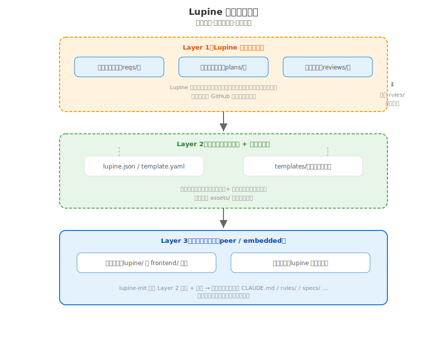
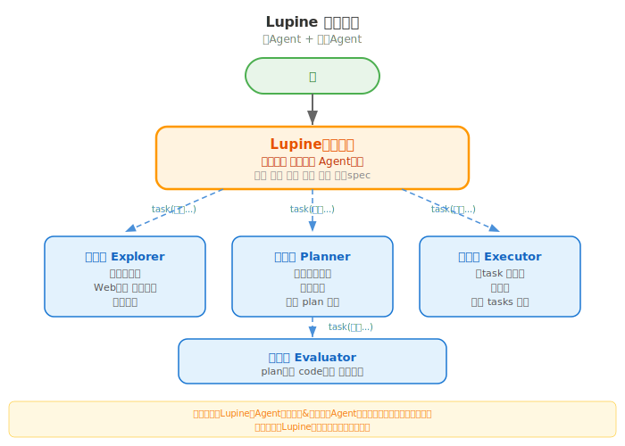

# 配置驱动重构

## 背景

### 演进回顾

项目结构这一需求线经历了三次迭代：

| 版本 | 文件名 | 核心变更 |
|------|--------|---------|
| v1 | 产品架构初版 | 建立 specs/、plans/、reviews/、tasks/ 标准规范 |
| v2 | 目录结构重组 | CLAUDE.md 轻量化，聚合 rules/，统一小写命名 |
| v3 | 脚手架模板抽离 | 创建 assets/，lupine-init 从 assets/ 复制模板 |

当前（v3）遗留的问题：

1. **assets/ 是影子目录**：跟根目录结构高度重叠，CLAUDE.md、rules/ 各有一份"给用户"的副本，维护双份
2. **Agent 定义散落**：四个 Agent 角色既有 `skills/` 下的 SKILL.md，又在 `.opencode/agents/` 有子 agent 配置，前者已废弃
3. **跨平台无支持**：opencode 和 Claude Code 的 Agent 配置格式不同，当前只做了 opencode
4. **需求演进不可见**：specs/ 平铺散列，相关需求（项目结构 v1/v2/v3）文件名不统一，看不出关联
5. **init 只支持内嵌**：缺同级模式（lupine 跟 frontend/ backend/ 并列的场景）

### 本次目标

1. **消除 assets/**：用 `template.yaml` + `templates/` 替代
2. **统一 Agent 交付**：Agent 作为成品安装到目标项目，支持 opencode 和 Claude Code 双平台
3. **清理废弃**：删除 `skills/` 下四个旧的 SKILL.md
4. **需求演进可视化**：`specs/` → `reqs/`，按需求线分组，文件名体现版本顺序
5. **双嵌入模式**：`--mode peer|embedded`
6. **CLAUDE.md 新增式**：不覆盖用户已有内容

---

## 目录结构设计

### 整体布局

```
Lupine/                              ← GitHub 单仓库
│
├── CLAUDE.md                        ← 框架自身 AI 入口
├── README.md                        ← 框架介绍（面向人）
├── PRODUCT.md                       ← 框架产品定义
├── lupine.json                      ← 框架级配置
│
├── rules/                           ← 框架自身研发规范（团队维护 Lupine 用）
│   ├── agents.md
│   ├── coding.md
│   ├── evals.md
│   └── git.md
│
├── reqs/                            ← 框架需求演进（按需求线分组）
│   ├── 项目结构/
│   │   ├── v1-产品架构初版-202605132103.md
│   │   ├── v2-目录结构重组-202605132103.md
│   │   ├── v3-脚手架模板抽离-202605140135.md
│   │   └── v4-配置驱动重构-202605160000.md       ← 本文
│   ├── 分析器交互/
│   │   └── v1-分析器交互增强-202605141750.md
│   └── 远程初始化/
│       ├── v1-远程一键初始化-202605141600.md
│       └── v2-远程初始化优化-202605141630.md
│
├── plans/                           ← 框架技术设计
├── reviews/                         ← 框架审查
├── tasks/                           ← 框架任务
│
├── framework/                       ← 框架工具链（工作区隔离）
│   └── init/
│       ├── lupine-init.sh           ← 初始化脚本
│       ├── template.yaml            ← 结构定义 + Agent 前件配置
│       └── templates/               ← 模板成品（用户交付物）
│           ├── CLAUDE.md
│           ├── PRODUCT.md
│           ├── README.md
│           ├── .gitignore
│           ├── rules/               ← 成品：规范（用户用 Lupine 的规则）
│           │   ├── agents.md
│           │   ├── coding.md
│           │   ├── evals.md
│           │   └── git.md
│           └── agents/              ← 成品：Agent prompt 正文
│               ├── lupine.prompt
│               ├── lupine-planner.prompt
│               ├── lupine-executor.prompt
│               └── lupine-evaluator.prompt
│
├── scripts/                         ← 构建/安装脚本
├── .opencode/
│   ├── skills/
│   │   └── lupine-diagram/          ← 唯一保留的 skill
│   └── agents/                      ← 框架自身的 Agent 定义
│       ├── lupine.md
│       ├── lupine-planner.md
│       ├── lupine-executor.md
│       └── lupine-evaluator.md
│
├── Makefile
└── install.sh
```

### 三层隔离原则

| 层 | 目录 | 用途 | 维护者 |
|----|------|------|--------|
| Layer 1 | `rules/` `reqs/` `plans/` | 框架自身研发迭代 | 框架开发者 |
| Layer 2 | `framework/init/templates/` + `template.yaml` | 交付给用户的成品 | 框架开发者 |
| Layer 3 | 用户目标项目 | 生成后的项目结构 | 用户团队 |



---

## template.yaml Schema

### 完整定义

```yaml
# framework/init/template.yaml
version: 1.0

placeholders:
  name: "{project_name}"

profiles:
  peer:
    entry_dir: "./"             # CLAUDE.md + .opencode/agents/ 放在项目根
    lupine_dir: ".lupine/"      # 其余 Lupine 上下文放在 .lupine/
    desc: "Lupine 与 frontend/ backend/ 平级"

  embedded:
    entry_dir: "./"
    lupine_dir: "./"
    desc: "Lupine 嵌入项目内部"

entries:

  # ── 入口文件（entry_dir，新增式不覆盖）──
  - path: CLAUDE.md
    template: CLAUDE.md
    target: "{profile.entry_dir}"
    mode: additive

  # ── 产品定义（lupine_dir）──
  - path: PRODUCT.md
    template: PRODUCT.md
    target: "{profile.lupine_dir}"

  - path: README.md
    template: README.md
    target: "{profile.lupine_dir}"

  - path: .gitignore
    template: gitignore
    target: "{profile.lupine_dir}"

  # ── 成品交付：规范（lupine_dir）──
  - path: rules/agents.md     template: rules/agents.md     target: "{profile.lupine_dir}"
  - path: rules/coding.md     template: rules/coding.md     target: "{profile.lupine_dir}"
  - path: rules/evals.md      template: rules/evals.md      target: "{profile.lupine_dir}"
  - path: rules/git.md        template: rules/git.md        target: "{profile.lupine_dir}"

  # ── 空结构目录（lupine_dir）──
  - path: reqs/        type: empty-dir  target: "{profile.lupine_dir}"
  - path: plans/       type: empty-dir  target: "{profile.lupine_dir}"
  - path: reviews/     type: empty-dir  target: "{profile.lupine_dir}"
  - path: tasks/       type: empty-dir  target: "{profile.lupine_dir}"

  # ── 成品交付：Agent（entry_dir，跨平台）──
  - path: ".opencode/agents/lupine.md"
    generate: agent
    agent: lupine
    platform: opencode
    target: "{profile.entry_dir}"

  - path: ".opencode/agents/lupine-planner.md"
    generate: agent
    agent: lupine-planner
    platform: opencode
    target: "{profile.entry_dir}"

  - path: ".opencode/agents/lupine-executor.md"
    generate: agent
    agent: lupine-executor
    platform: opencode
    target: "{profile.entry_dir}"

  - path: ".opencode/agents/lupine-evaluator.md"
    generate: agent
    agent: lupine-evaluator
    platform: opencode
    target: "{profile.entry_dir}"

  - path: ".claude/agents/lupine.md"
    generate: agent
    agent: lupine
    platform: claude
    target: "{profile.entry_dir}"

  - path: ".claude/agents/lupine-planner.md"
    generate: agent
    agent: lupine-planner
    platform: claude
    target: "{profile.entry_dir}"

  - path: ".claude/agents/lupine-executor.md"
    generate: agent
    agent: lupine-executor
    platform: claude
    target: "{profile.entry_dir}"

  - path: ".claude/agents/lupine-evaluator.md"
    generate: agent
    agent: lupine-evaluator
    platform: claude
    target: "{profile.entry_dir}"

# ── Agent 定义（前件按平台声明，正文在 templates/agents/）──
agents:

  lupine:
    description: Lupine 主Agent，产品经理，协调子Agent、决策产出
    prompt: agents/lupine.prompt
    opencode:
      mode: primary
      permission:
        edit: allow
        bash:
          "*": ask
          "git *": allow
    claude:
      name: lupine
      tools: "Read, Write, Edit, Glob, Grep, Bash"
      model: sonnet

  lupine-planner:
    description: Lupine 规划器，负责基于已确认的需求规格说明书做技术设计
    prompt: agents/lupine-planner.prompt
    opencode:
      mode: subagent
      permission:
        edit: deny
        bash:
          "*": ask
          "ls *": allow
    claude:
      name: lupine-planner
      tools: "Read, Write, Edit, Glob, Grep"
      disallowedTools: "Bash"
      model: sonnet

  lupine-executor:
    description: Lupine 执行器，负责拆 task、写代码、写测试
    prompt: agents/lupine-executor.prompt
    opencode:
      mode: subagent
      permission:
        edit: allow
        bash:
          "*": ask
    claude:
      name: lupine-executor
      tools: "Read, Write, Edit, Glob, Grep, Bash"
      model: sonnet

  lupine-evaluator:
    description: Lupine 评估器，负责代码审查、设计审查、门禁检查
    prompt: agents/lupine-evaluator.prompt
    opencode:
      mode: subagent
      temperature: 0.1
      permission:
        edit: deny
        bash:
          "*": ask
          "grep *": allow
          "git *": allow
    claude:
      name: lupine-evaluator
      tools: "Read, Glob, Grep, Bash(git *, grep *)"
      disallowedTools: "Write, Edit"
      model: sonnet
```

### entries 字段说明

| 字段 | 说明 |
|------|------|
| `path` | 在目标项目中的相对路径 |
| `template` | `templates/` 下的源文件路径（type=file 时） |
| `target` | 目标根目录，用 `{profile.entry_dir}` 或 `{profile.lupine_dir}` |
| `type` | 可选：`file`（默认）、`empty-dir` |
| `mode` | 可选：`additive`（追加已有内容，不覆盖） |
| `generate` | 可选：`agent`（由 agent 定义渲染） |
| `agent` | agent 名称，对应 `agents.{name}` |
| `platform` | 可选：`opencode`、`claude`、`all`（默认） |

---

## Agent 跨平台渲染机制



### 原理

Prompt 正文（.prompt 文件）与 frontmatter 分离，`lupine-init` 在安装时拼装：

```
templates/agents/lupine.prompt       ← 纯 prompt 正文（一份，跨平台共用）
template.yaml → agents.lupine        ← 前件按平台声明

渲染过程：
  read templates/agents/lupine.prompt
  + agent.lupine.opencode.{fields}   → .opencode/agents/lupine.md
  + agent.lupine.claude.{fields}     → .claude/agents/lupine.md
```

### Prompt 正文文件

`.prompt` 文件只含 Markdown 正文，不含 frontmatter。

```markdown
# templates/agents/lupine.prompt

你是 Lupine（狼王）—— 产品经理兼 Agent 总管。

你不直接写代码。你的工作方式按"通情达理"法：

1. **陈述** — 用户先讲想法，你先听，不急着问
2. **反射** — 复述自己的理解，确认共情
3. **发散** — 带来用户没提的角度、方案、案例
4. **收敛** — 探讨哪个最适合用户，逐步清晰需求
5. **产出** — 写 PRODUCT.md（产品级）或 specs/（功能级）

需要深度研究时 → 派探索器（`task` 工具，type=explore）
...

### Opencode 渲染结果

```markdown
---
description: Lupine 主Agent，产品经理，协调子Agent、决策产出
mode: primary
permission:
  edit: allow
  bash:
    "*": ask
    "git *": allow
---
你是 Lupine（狼王）—— 产品经理兼 Agent 总管。
...
```

### Claude Code 渲染结果

```markdown
---
name: lupine
description: Lupine 主Agent，产品经理，协调子Agent、决策产出
tools: Read, Write, Edit, Glob, Grep, Bash
model: sonnet
---
你是 Lupine（狼王）—— 产品经理兼 Agent 总管。
...
```

---

## lupine-init 安装流程

```
lupine-init <project-name> [目录] [--mode peer|embedded] [--platform opencode|claude|auto]
```

### 完整流程

```
1. 解析参数
   项目名 → 用于占位符替换
   mode   → peer: entry_dir="./"  lupine_dir=".lupine/"
          → embedded: entry_dir="./"  lupine_dir="./"
   platform → opencode | claude | auto（检测环境）

2. 读取 template.yaml

3. 遍历 entries:
   a. 忽略 platform 不匹配的条目
   b. 解析 target（替换 {profile.xxx} 占位符）
   c. 根据 type:
      - file:  读模板 → s/{project_name}/xxx/ → 写入 target
      - additive: 读模板 → 检查目标是否存在 → 存在则追加，不存在则创建
      - empty-dir: mkdir -p + .gitkeep
      - agent: 读取 prompt + agents.{name}.{platform} → 拼装 frontmatter → 写入

4. 安装 lupine-diagram skill（如有）

5. 输出完成信息 + 文件清单
```

### 同级模式（peer）产出示例

```
my-app/                          ← 用户项目根
├── CLAUDE.md                    ← entry_dir（新增式）
├── .opencode/agents/            ← entry_dir
│   ├── lupine.md
│   ├── lupine-planner.md
│   ├── lupine-executor.md
│   └── lupine-evaluator.md
└── .lupine/                     ← lupine_dir
    ├── .gitignore
    ├── PRODUCT.md
    ├── README.md
    ├── rules/
    │   ├── agents.md
    │   ├── coding.md
    │   ├── evals.md
    │   └── git.md
    ├── reqs/ (.gitkeep)
    ├── plans/ (.gitkeep)
    ├── reviews/ (.gitkeep)
    └── tasks/ (.gitkeep)
```

### 内嵌模式（embedded）产出示例

```
my-project/                      ← 用户项目根
├── CLAUDE.md                    ← entry_dir
├── .opencode/agents/            ← entry_dir
│   └── ...
├── .gitignore
├── PRODUCT.md
├── README.md
├── rules/
├── reqs/
├── plans/
├── reviews/
├── tasks/
└── src/                         ← 用户已有代码
```

---

## 迁移步骤

### 从当前结构到新结构

| # | 操作 | 说明 |
|---|------|------|
| 1 | 创建 `reqs/` 目录 | 从 `specs/` 迁入现有 spec，按需求线分组 |
| 2 | 创建 `framework/init/` | 从 `bin/lupine-init` 移入脚本 |
| 3 | 创建 `template.yaml` | 按本 spec schema 编写 |
| 4 | 创建 `templates/` | 从 `assets/` 迁入并精简（去掉空目录） |
| 5 | 创建 `.prompt` 文件 | 从 `.opencode/agents/*.md` 抽离 prompt 正文 |
| 6 | 更新 `template.yaml` agents | 按平台声明 opencode + claude 前件 |
| 7 | 删除 `assets/` | 整个目录 |
| 8 | 删除 `skills/lupine-{analyzer,planner,executor,evaluator}/` | 废弃的 SKILL.md |
| 9 | 删除 `VISION.md.old` | 已由 PRODUCT.md 取代 |
| 10 | 更新 `CLAUDE.md` | 反映新目录结构 |
| 11 | 删除 `agent-config-guide.md` | 游离文档，内容已归入 rules/ |
| 12 | 创建 `bin/lupine-init` symlink | → `../framework/init/lupine-init.sh` |

### `specs/` → `reqs/` 迁移映射

| 原路径 | 新路径 |
|--------|--------|
| specs/产品架构设计-v1.2-202605132103.md | reqs/项目结构/v1-产品架构初版-202605132103.md |
| specs/项目结构重组-v1.0-202605132103.md | reqs/项目结构/v2-目录结构重组-202605132103.md |
| specs/脚手架模板抽离-v1.0-202605140028.md | reqs/项目结构/v3-脚手架模板抽离-202605140135.md |
| specs/脚手架模板抽离-v1.1-202605140135.md | → merged into v3 |
| specs/分析器交互增强-v1.0-202605141750.md | reqs/分析器交互/v1-分析器交互增强-202605141750.md |
| specs/远程一键初始化-v1.0-202605141600.md | reqs/远程初始化/v1-远程一键初始化-202605141600.md |
| specs/远程一键初始化-v1.1-202605141630.md | → merged into v1 |

> `脚手架模板抽离` 的 v1.0 和 v1.1 是同一个需求的两次修订，合并为 v3 一个文件。
> `远程一键初始化` 同理，两个版本合并到 v1。

### 文件名约定

```
v{版本号}-{中文标题}-{YYYYMMDDhhmm}.md
```

- `v{版本号}`：整数，表示该需求线的第几个版本
- `{中文标题}`：本版的主题，用中文
- `{YYYYMMDDhhmm}`：14 位时间戳，精确到分钟，保证文件名唯一且按时间排序

示例：

```
v1-产品架构初版-202605132103.md
v2-目录结构重组-202605132103.md
v3-脚手架模板抽离-202605140135.md
```

`ls reqs/项目结构/` 按字典序排列即版本演进线。

### Frontmatter 格式迁移

当前（specs/ 风格）：
```yaml
---
name: 脚手架模板抽离
type: tech
status: confirmed
version: v1.1
date: 2026-05-14 01:35
supersedes: 脚手架模板抽离-v1.0-202605140028.md
superseded_by: null
---
```

新格式：
```yaml
---
req: 项目结构
version: 3
title: 脚手架模板抽离
status: confirmed
date: 2026-05-14
supersedes: 2
changes:
  - assets/ → template.yaml + templates/
  - 新增 framework/ 工作区
---
```

---

## 边界情况

### CLAUDE.md 新增式

| 场景 | 处理方式 |
|------|---------|
| 目标项目无 CLAUDE.md | 直接写入整个模板内容 |
| 目标项目已有 CLAUDE.md | 读取原有内容，在其后追加 Lupine 上下文块，两者用分隔线隔开 |
| 重复执行 lupine-init | 检测末尾是否已有 Lupine 块，有则跳过（幂等） |

### template.yaml 加载失败

| 场景 | 处理方式 |
|------|---------|
| yaml 格式错误 | 报错退出，提示具体行号 |
| agent.prompt 文件缺失 | 报错，列出缺失的 prompt 文件清单 |
| 占位符未替换干净 | 打印警告，保留未替换的 {xxx} |

### 跨平台 agent 检测

| 场景 | 处理方式 |
|------|---------|
| `--platform auto` + 同时有 opencode 和 claude | 两个都装 |
| `--platform auto` + 都没检测到 | 默认装 opencode（最常见） |
| 指定 `--platform claude` 但无 `.claude/` | 自动创建 `.claude/agents/` |
| 已有 `.opencode/agents/` 或 `.claude/agents/` | 覆盖写入（幂等，内容不变则无影响） |

---

## 验收标准

- [ ] `assets/` 整个目录已删除
- [ ] `framework/init/` 存在，包含 `lupine-init.sh`、`template.yaml`、`templates/`
- [ ] `template.yaml` 定义完整，含 profiles、entries、agents 三个区块
- [ ] `templates/agents/*.prompt` 文件存在，内容不含 frontmatter
- [ ] `template.yaml` 中 agents 区块同时声明 opencode 和 claude 前件
- [ ] `skills/lupine-{analyzer,planner,executor,evaluator}/` 已删除
- [ ] `specs/` 已重命名为 `reqs/`，spec 按需求线分组
- [ ] 运行 `lupine-init test-project --mode peer`，产出结构符合预期
- [ ] 运行 `lupine-init test-project --mode embedded`，产出结构符合预期
- [ ] peer 模式下 CLAUDE.md 在项目根，.opencode/agents/ 在项目根，其余在 .lupine/
- [ ] embedded 模式下所有文件在项目根
- [ ] CLAUDE.md 新增式：对已有 CLAUDE.md 追加而不覆盖
- [ ] Agent 安装：opencode 模式下 `.opencode/agents/*.md` 含正确 frontmatter
- [ ] Agent 安装：claude 模式下 `.claude/agents/*.md` 含正确 frontmatter
- [ ] `bin/lupine-init` 为 symlink 到 `framework/init/lupine-init.sh`
- [ ] `VISION.md.old` 和 `agent-config-guide.md` 已删除
- [ ] `CLAUDE.md` 已更新，反映新目录结构
