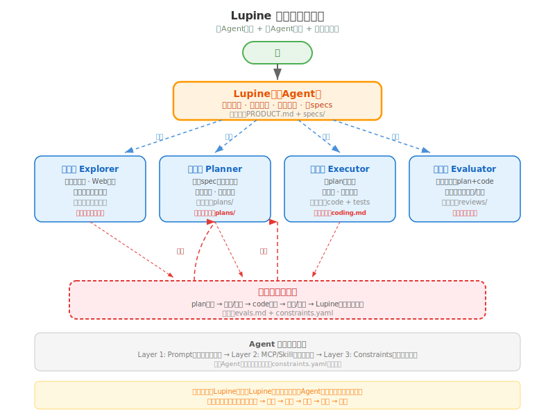

# 角色模型

> Lupine 五角色定义、职责边界、Agent 能力三层结构、约束机制

---

## 1. 概述

Lupine 采用**一个主 Agent + 四个子 Agent**的协作模型。主 Agent（Lupine）承担产品经理角色，负责需求澄清、方案探讨和调度决策；四个子 Agent 各司其职，在约束下完成专业任务。

---

## 2. 角色定义

### 2.1 五角色总览

| 角色 | 类型 | 核心职责 | 产出物 |
|------|------|---------|--------|
| **调度器 Lupine** | 主 Agent | 调度器 + 产品经理。对话探讨、写 specs、调度子 Agent | PRODUCT.md + specs/ |
| **探索器 Explorer** | 子 Agent | 代码库探索、Web 搜索、文档阅读（**只读**） | 情报摘要 |
| **规划器 Planner** | 子 Agent | 基于需求写执行计划（新功能/优化/Bug 修复） | plans/ |
| **执行器 Executor** | 子 Agent | 按 plan 写代码、写测试 | code + tests |
| **评估器 Evaluator** | 子 Agent | 按约束审 plan + 审 code，门禁控制 | reviews/ |



### 2.2 角色详细定义

**Lupine（主 Agent）**
- 你是用户对话的唯一入口
- 负责需求澄清、方案探讨、发散→收敛
- 写 specs（WHAT + WHY），不直接写代码
- 调度子 Agent：决定什么时候调用谁、给什么上下文
- 审查评估器的 review 结果，决定是否合并或打回

**探索器（只读）**
- 代码库探索：理解现有架构、依赖关系、代码风格
- Web 搜索：调研技术方案、第三方库、最佳实践
- 文档阅读：读取项目文档、API 文档、README
- **硬规则**：只能读取，不能修改任何文件

**规划器（只写 plans/）**
- 基于 specs 写执行计划（plans/）
- 定义任务拆分、依赖关系、验收标准
- **硬规则**：只能写 plans/ 目录，不能碰代码

**执行器（写 code + tests）**
- 按 plan 写代码、写测试
- 遵循 coding.md 规范
- 自测通过后提交

**评估器（门禁控制）**
- 按 evals.md 及 prompt 中内联的约束审查 plan 和 code
- 有否决权：不合格的打回，附具体原因
- 审查通过后，review 文档写入 reviews/

---

## 3. 职责边界（硬规则）

### 3.1 产出物所有权

| 产出物 | 所有者 | 其他角色权限 |
|--------|--------|-------------|
| PRODUCT.md + specs/ | Lupine | 只读 |
| plans/ | 规划器 | Lupine 只读，执行器只读 |
| code + tests | 执行器 | 评估器只读 |
| reviews/ | 评估器 | 所有角色只读 |

**违反后果**：评估器门禁不通过，打回重做。

### 3.2 工具限域

| 角色 | 允许的操作 |
|------|-----------|
| 探索器 | 读取任何文件、Web 搜索 |
| 规划器 | 写 plans/、读 specs/ 和 PRODUCT.md |
| 执行器 | 写 code/tests、读 plans/ 和 specs/ |
| 评估器 | 读所有文件、写 reviews/ |

---

## 4. Agent 能力模型

### 4.1 三层能力结构

每个 Agent 的能力由三层组成：

```
┌─────────────────────────────────────┐
│  Layer 1: Prompt（系统提示词）         │
│  - 角色定义、职责边界、工作流规则        │
├─────────────────────────────────────┤
│  Layer 2: MCP / Skill（工具集）        │
│  - 代码搜索、文件操作、Web 搜索、Git    │
├─────────────────────────────────────┤
│  Layer 3: Constraints（约束）          │
│  - 质量指导原则、注入 prompt 的行为约束  │
└─────────────────────────────────────┘
```

### 4.2 各角色能力层

| 角色 | Prompt | MCP/Skill | Constraints |
|------|--------|-----------|-------------|
| Lupine | 调度决策、需求澄清 | 文件读写、Git、对话 | 无（自主决策） |
| 探索器 | 只读探索 | 代码搜索、Web 搜索 | 禁止写入 |
| 规划器 | 写 plan | 文件读写 | plan 只读约束 |
| 执行器 | 写 code | 文件读写、测试运行 | coding.md 规范 |
| 评估器 | 审查 | 文件读取 | evals.md 标准 |

### 4.3 工具推荐

**MCP（Model Context Protocol）**
- `filesystem`：文件读写
- `git`：版本控制
- `web-search`：网络搜索
- `playwright`：浏览器自动化（测试用）

**Skill**
- 代码搜索（ripgrep/ast-grep）
- 测试运行（jest/pytest）
- 文档生成

---

## 5. 约束机制

### 5.1 约束内联

每个 Agent 的约束**直接内联在 prompt 中**，无需外部 YAML 文件。Agent 定义文件即是约束的单一事实来源。

prompt 模板存放在 `packages/lupine/templates/agents/`，渲染为各 AI 工具的 Agent 配置文件（如 opencode 的 `.opencode/agents/*.md`、Claude Code 的 `.claude/agents/*.md`）。

**约束来源**：
1. **角色约束**：定义在 Agent 的 prompt 中，与该角色的行为规则绑定
2. **自定义约束**：用户可直接编辑目标工具的 Agent 配置文件增删约束

**设计考量**：
- 去除 `rules/constraints.yaml` 中间层，减少概念负担
- Agent 最终交付物自包含、自描述
- 纯文本 prompt 比 YAML 更灵活，支持自然语言表达复杂约束

```
──────────────────────────────────
约束：
1. 冒烟测试 — 核心功能是否跑得通
2. 回归测试 — 改代码后旧功能没坏
3. 功能测试 — 功能是否按需求规格工作
4. 边界值测试 — 输入在边界上的表现
5. 等价类划分 — 用代表性输入覆盖所有类别
```

### 5.3 约束示例

各 Agent 的约束直接定义在其 prompt 中（以 opencode 格式为例）：

**探索器约束**：
- 你只能读取文件，不能修改、创建或删除任何文件
- 你的产出物只能是情报摘要（文本），不能是代码

**规划器约束**：
- 你只能写 plans/ 目录下的文件
- plan 必须包含：任务拆分、依赖关系、验收标准
- 不可直接引用代码实现细节

**执行器约束**：
- 必须遵循 coding.md 的命名规范和测试要求
- 每段代码必须有对应的测试覆盖
- commit 信息必须符合 git.md 规范

**评估器约束**：
- 必须按照 evals.md 的 checklist 逐项审查
- 不通过时必须给出具体原因和修改建议
- 不能仅说"有问题"，必须指出哪里有问题

---

## 6. 变更记录

| 产品版本 | 变更内容 | 状态 |
|---------|---------|------|
| v0.4 | 移除 constraints.yaml，约束直接内联在 Agent prompt 中 | supersedes v0.3 |
| v0.3 | 新增角色能力模型（Prompt+MCP/Skill+Constraints）与约束机制（constraints.yaml） | superseded |
| v0.2 | 升级为五角色模型：Lupine 升为主 Agent（产品经理），新增探索器作为只读原子 Agent，取消分析器 | completed |
| v0.1 | 四角色模型：分析器、规划器、评估器、执行器 | superseded |
